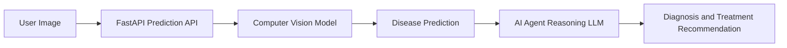

# AI Plant Disease Diagnosis Agent
End-to-end computer vision system with LLM-powered agent for plant disease diagnosis, treatment recommendation, and prevention guidance.

## Problem Statement
Plant disease detection is often delayed due to lack of expert availability.
This project builds an AI-powered diagnosis system capable of identifying plant diseases from leaf images and providing actionable recommendations using an intelligent agent.

## System Architecture

## Features 
1. Framework: PyTorch
2. Dataset: PlantVillage
3. Model: EfficientNet / YOLOv8
4. Metrics
   1. Accuracy :
   2. F1-Score :

## API Endpoints

### Predict Disease

**POST** `/predict`

#### Request
```image: file```

#### Response
```json
{
  "disease": "Tomato Early Blight",
  "confidence": 0.93,
  "recommendation": "Apply fungicide and remove infected leaves"
}
```
## Installation


```bash
git clone https://github.com/username/ai-plant-disease-agent.git
cd ai-plant-disease-agent
pip install -r requirements.txt
```

## Installation
```uvicorn src.api.main:app --reloadt
```
